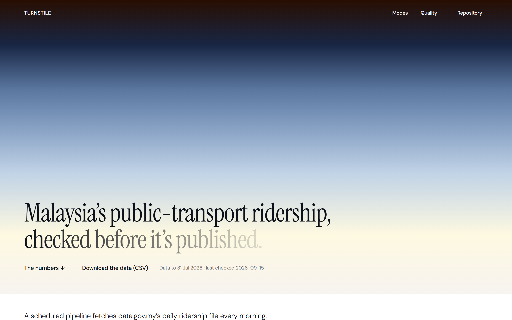
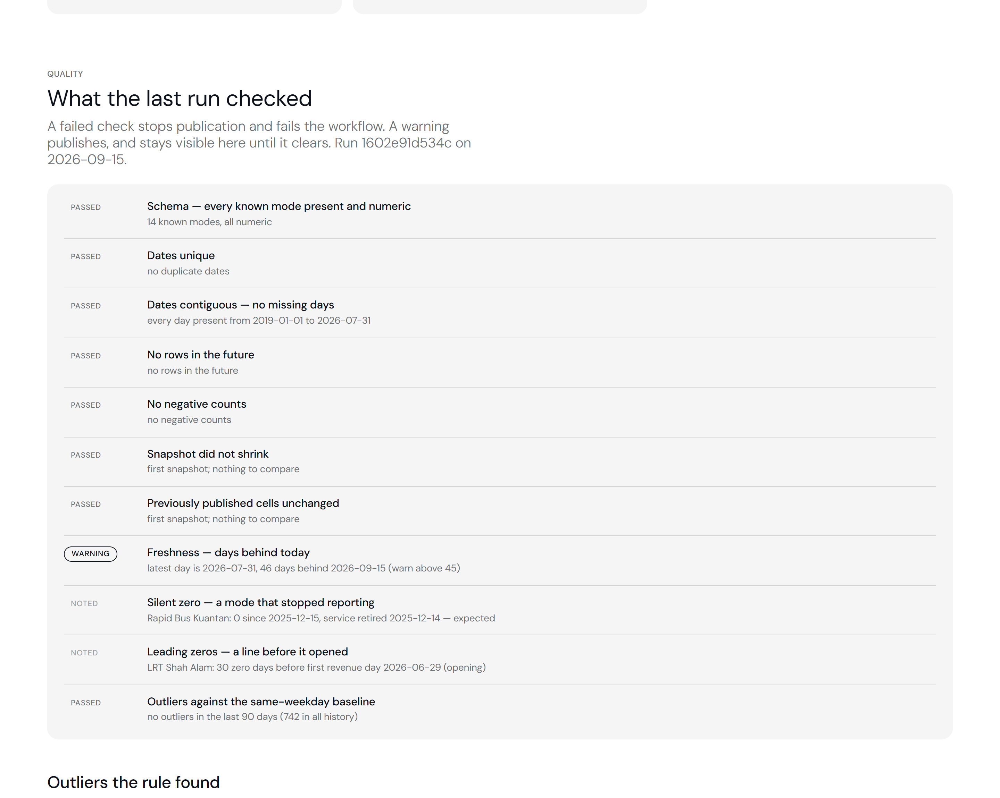

# Turnstile

[](https://github.com/direenvy/turnstile/actions/workflows/ci.yml)
[](https://github.com/direenvy/turnstile/actions/workflows/pipeline.yml)

**Live:** [turnstile-tawny.vercel.app](https://turnstile-tawny.vercel.app) — rebuilt automatically on every pipeline commit.

Malaysia's public-transport ridership, ingested every morning, checked before it is
published, and shown on a dashboard that says when it was last checked.

A scheduled GitHub Actions job fetches data.gov.my's *Daily Public Transport Ridership*
file (14 modes, daily since 2019), keeps every distinct snapshot it has ever seen, runs
eleven data-quality checks, and publishes a set of small marts that a static Next.js page
reads at build time. A failed check fails the workflow and publishes nothing; a warning
publishes and stays on the page until it clears.



---

## What the first run found

The checks were written for feed breaks. Run over the whole history on day one, they found
three real things before any code was tuned to them:

| Finding | What the check saw | What it turned out to be |
|---|---|---|
| **Rapid Bus Kuantan reports 0 every day since 15 Dec 2025** | `silent_zero`: a mode with a healthy trailing median suddenly flat at zero for 229 days | The service ended on 14 December 2025 and was replaced by a Sanwa Tours stage-bus service under SBST. Recorded in `config.py` as `retired`; the flag became a note. |
| **MRT Putrajaya fell to 19% of normal on 25–26 Oct 2025** | `outliers`: 32,971 trips against a same-weekday baseline of 116,886 (0.28×) | A genuine service disruption. The other lines showed only their usual Saturday dip, which is why the baseline is same-weekday and not day-over-day. |
| **LRT Shah Alam carries 30 zero days before 29 Jun 2026** | `leading_zeros`: zeros before the first revenue day | A line opening. Information, not a flag — a rule that cried wolf on every new line would be ignored by the second one. |

And two numbers the dashboard leads with: at the first run the newest row was **46 days
old** (data.gov.my publishes monthly, after audit — the freshness check is set to warn at
45, so this is the pipeline doing its job on a slow publisher, not a fault), and July 2026
carried **42.9 million trips**, +6.3% on July 2025, with MRT Kajang the busiest mode at
277,571 trips a day.

## The checks

| # | Check | Severity when it fires | Rule |
|---|---|---|---|
| 1 | `schema` | error / warn | every known mode present and numeric; an unknown extra column only warns |
| 2 | `date_unique` | error | no duplicate dates |
| 3 | `date_contiguous` | error | every day present between the first and last date |
| 4 | `no_future` | error | no row dated after the run |
| 5 | `non_negative` | error | no negative counts |
| 6 | `no_regression` | error | the new snapshot must not have fewer rows or an earlier last day than the previous one |
| 7 | `revisions` | info / warn | previously published cells that changed, counted; warns above 5% |
| 8 | `freshness` | warn | last day more than 45 days behind the run |
| 9 | `silent_zero` | warn / info | ≥ 7 trailing zeros on a mode that used to report; info if `config.py` records a retirement before the onset |
| 10 | `leading_zeros` | info | zeros before a mode's first positive day |
| 11 | `outliers` | warn | a day below 0.35× or above 2.5× the median of the same weekday over the previous 8 weeks; warns only for the last 90 days, but the full history is published |

Errors stop publication and fail the workflow (GitHub emails the owner). Warnings publish.
Thresholds live in [`pipeline/config.py`](pipeline/config.py), not in the checks.

Over the full history the outlier rule flags 742 day-mode pairs: 293 in 2020 and 336 in
2021 — the movement-control orders — then 23, 61, 7, 10 and 12 a year. The high-side hits
sit on the festive calendar: KTM Komuter at 3.8–4.5× baseline on 31 Jan–1 Feb 2026 is
Thaipusam at Batu Caves; KTM Intercity's spikes fall on Chinese New Year, Malaysia Day and
Raya. The rule cannot tell a holiday from a fault, and does not try to; it surfaces both.



## Three decisions worth explaining

**1. A flag becomes a recorded decision, not a special case in code.**
When Rapid Kuantan went to zero the pipeline could not know whether the feed had broken or
the buses had stopped. It said so, in those words. The answer — service ended 14 December
2025 — went into `config.py` as a `retired` date with a note; the check now reads that and
downgrades the finding to *info*, the dashboard marks the mode retired, and the outlier
rule stops judging it after that day. Nothing in `validate.py` knows the name of any mode.

**2. Same-weekday baseline, because day-over-day flags every Saturday.**
Ridership drops by a quarter to a third at weekends — over the last 52 weeks rail runs at 75%
of a weekday on Saturday and 67% on Sunday, bus at 74% on Saturday; the dashboard's weekday
chart shows it. A day-over-day rule would fire twice a week forever;
a rolling mean would smear weekends into weekdays. Each day is instead compared with the
median of the same weekday over the previous eight weeks, with zeros and gaps not voting.
That is what let the MRT Putrajaya collapse stand out on a Saturday while the other lines'
Saturday dips did not.

**3. The repository is the database.**
Every distinct upstream file is kept under its content hash (about 110 KB each, monthly),
the tidy table is one parquet, the marts are JSON committed next to the dashboard, and
every run appends a record whether it passed or not. `git log` is the audit trail; a revert
is a rollback; Vercel redeploys the dashboard on the data commit. At this volume a database
would add a service to run and nothing to show for it. DuckDB does the aggregation straight
off the parquet at run time.

## Interface

The dashboard follows the **New Genre** style reference ([DESIGN.md](DESIGN.md)): a white
canvas, Onyx `#0c1018` text, one monumental dawn-arc gradient as the hero (charred umber
through steel twilight to warm parchment), a condensed serif for display only and a
low-weight geometric sans for everything else. Instrument Serif and DM Sans stand in for
the licensed Serrif Condensed and Saans Variable. Cards are `#f5f5f5` at 16px with no
shadow; controls are pills; the footer is the gradient's darkest stop as a solid.

The system is achromatic at the interface level, which a data-quality page has to
respect deliberately: **status is carried by shape and weight, not hue** — a failed check
is an Onyx-filled pill, a warning an Onyx-outlined one, passed and noted are grey text.
Chart marks are Onyx and Slate Veil; the dawn arc's steel blue sits under the first line as
a wash, never as a category colour. Where the page compares up to three modes on one chart,
they are told apart by line texture (solid, dashed, dotted), not hue. Direction on the mode cards is sign and weight. Every
figure remains readable with the colour removed because there is no colour to remove.

## Architecture

```
pipeline/
  config.py     source URL, paths, mode metadata (system, operator, retired), thresholds
  ingest.py     fetch → sha256 → keep if new → manifest.json
  validate.py   the eleven checks → Findings with severity
  transform.py  wide → long parquet; DuckDB → marts (summary, modes, monthly, daily, weekday, outliers)
  run.py        ingest → validate → transform → publish; run record; exit 1 on error
data/
  raw/          every distinct snapshot + manifest.json
  tidy/         ridership.parquet (date, mode, system, trips)
  quality/      latest.json + history.jsonl
  runs/         latest.json + history.jsonl
frontend/
  data/         the marts, written by the pipeline, imported at build time
  app/, components/   static Next.js dashboard (New Genre style reference, DESIGN.md)
tests/          19 tests on synthetic snapshots with known answers, plus ingest/transform/run end to end
.github/workflows/
  pipeline.yml  daily 02:00 UTC: run, then commit data/ and frontend/data/ back (also on failure)
  ci.yml        tests, then replay the committed snapshot through the checks; dashboard build
```

Idempotency: the same bytes are never stored twice, the marts are only rebuilt when the
snapshot is new (or `--force`), and a run against unchanged data records itself as
*unchanged* rather than pretending to publish.

## Running it

```bash
pip install -r requirements-dev.txt
python -m pytest tests -q
python -m pipeline.run                     # live download
python -m pipeline.run --file some.parquet --today 2026-09-15 --force   # replay
cd frontend && npm install && npm run dev  # dashboard on :3000
```

The dashboard has a range control (since 2019 / 5 years / 3 years / 12 months) that glides
between windows, a compare-modes view for up to three modes, a weekday profile, outlier
days marked on every mode's sparkline, and the tidy table as a CSV download
(`frontend/public/ridership.csv`, written by the pipeline).

The dashboard is on Vercel (root directory `frontend`, no environment variables) at
https://turnstile-tawny.vercel.app; it rebuilds whenever the pipeline commits.

## Limitations

- **The cadence is the publisher's.** data.gov.my updates this file monthly after audit,
  so most daily runs see nothing new; the run history says so honestly. A daily cron is
  still right — it is how the pipeline notices the month has landed within a day.
- **Trips, not passengers.** An interchange counts twice. Every figure on the page is a
  trip count and is labelled as one.
- **The outlier rule is blind to slow drift.** It compares each day with the last eight
  weeks, so a line losing 2% a month never fires. Year-on-year on the mode cards is the
  view for that.
- **Revisions are counted, not judged.** Audited figures may be restated; the pipeline
  reports how many cells changed and warns above 5%, but does not decide which version is
  right.
- **Alerting is GitHub's.** A failed run emails the repository owner; there is no pager,
  and nothing retries.
- **The known-events register is manual.** Retirements and openings are recorded by a
  person; the pipeline only points at them.

## Data

*Daily Public Transport Ridership*, Prasarana Malaysia and the Ministry of Transport,
published on [data.gov.my](https://data.gov.my/data-catalogue/ridership_headline) under
CC BY 4.0. Snapshots are stored in this repository under that licence with attribution.
